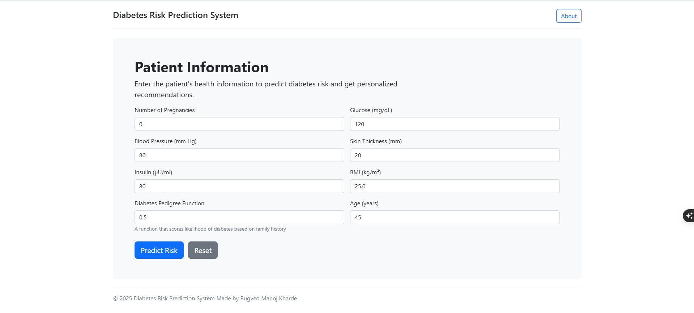
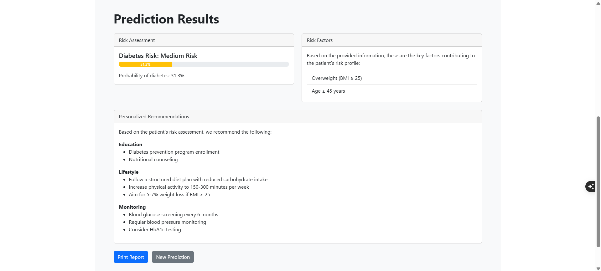
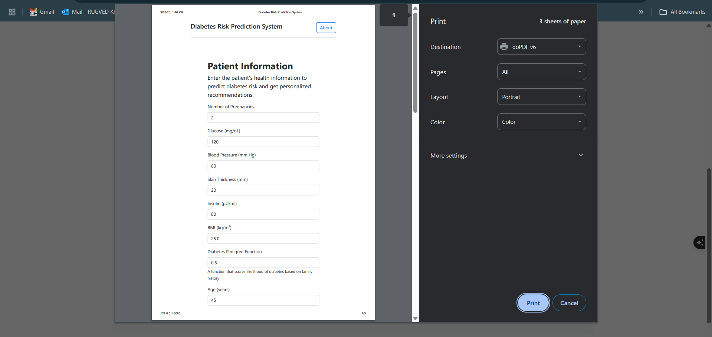
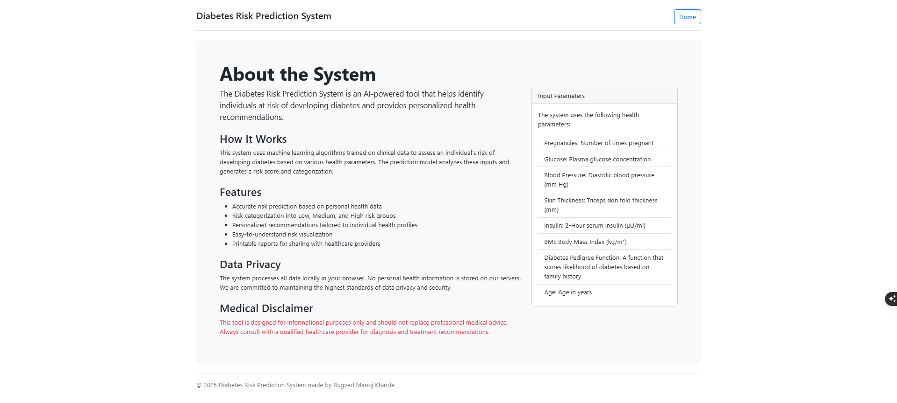

🌟 Overview
Diabetes Prediction is a comprehensive machine learning project designed to empower healthcare professionals and individuals in predicting and understanding diabetes risk with precision and insight. Leverage advanced data analysis and predictive modeling to gain deep understanding of diabetes indicators.

✨ Key Features
📊 Advanced Predictive Modeling
- Multiple machine learning algorithms for diabetes prediction
- Comprehensive feature analysis and selection
- High-accuracy risk assessment models

🔬 Data Preprocessing
- Robust data cleaning techniques
- Advanced feature engineering
- Handling of complex medical datasets

📈 Insightful Analytics
- Interactive visualization of diabetes risk factors
- Detailed model performance metrics
- Interpretable machine learning insights

🧬 Predictive Capabilities
- Risk score generation
- Probability-based diabetes likelihood assessment
- Personalized health insights

🖼️ Project Screenshots

### Home page


### Result page


### print page


### About us page



🏗️ Technical Architecture
🔹 Data Layer
- Comprehensive data preprocessing pipeline
- Advanced feature selection techniques
- Robust data handling and transformation

🔹 Machine Learning Layer
- Multiple model architectures
- Cross-validation techniques
- Performance optimization

🔹 Visualization Layer
- Interactive data exploration
- Model performance visualization
- Risk factor analysis charts

🚀 Getting Started
Prerequisites
- Python 3.8+
- Machine Learning Libraries (scikit-learn, pandas, numpy)
- Jupyter Notebook (recommended)

Installation
```bash
# Clone the repository
git clone https://github.com/RUGU2211/DiabetesPrediction.git

# Navigate to project directory
cd DiabetesPrediction

# Create virtual environment
python -m venv .venv
source .venv/bin/activate  # On Windows: .venv\Scripts\activate

# Install dependencies
pip install -r requirements.txt
```

🛠️ Tech Stack
- Language: Python
- Machine Learning: scikit-learn
- Data Processing: Pandas, NumPy
- Visualization: Matplotlib, Seaborn
- Notebook: Jupyter

📦 Key Dependencies
- scikit-learn
- pandas
- numpy
- matplotlib
- seaborn
- jupyter

📊 Project Structure
```
DiabetesPrediction/
│
├── data/                # Raw and processed datasets
├── diagrams/            # Diagrams of the clean dataset
├── models/              # Trained machine learning models
├── visualizations/      # Data and model visualization outputs
│── screenshots/         # Screenshots of the running model
│── templates/           # html files
├── app.py               # Main application interface
├── clean_dataset.py     # Data cleaning script
├── data_exploration.py  # Exploratory data analysis
├── data_preprocessing.py# Advanced data preprocessing
│── main.py              # main model
├── model_training.py    # Model training and evaluation
│── recommendation_system.py # Predictive insights system
|── requirements.txt         # reuirements file
```


📄 License
© 2025 Rugved Manoj Kharde, NMIMS Mumbai. All Rights Reserved.

📞 Contact Author: Rugved Manoj Kharde
📧 Email: RUGEVD.KHARDE81@nmims.in
🔗 Project Link: https://github.com/RUGU211/Diabetes_Prediction.git
Built with ❤️ for Healthcare Innovation
